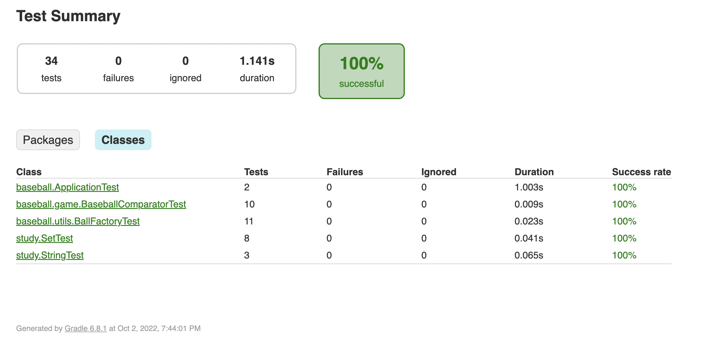

# 숫자 야구 게임 precourse

기간/이름: 2022.09.27 ~ 2022.10.03 / 전선규

> [기능 요구사항](#기능-요구사항)
>
> [프로그램 실행 결과](#기능-요구사항)
>
> [프로그래밍 요구사항1 - 제약사항](#프로그래밍-요구사항1---제약사항)
>
> [프로그래밍 요구사항2 - 제약사항](#프로그래밍-요구사항1---제약사항)
>
> [프로그래밍 요구사항3 - 단위 테스트](#프로그래밍-요구사항3---단위-테스트)
>
> [과제 진행 요구사항](#과제-진행-요구사항)
>
> [구현 기능 목록](#구현-기능-목록)
>
> [테스트 결과](#테스트-결과)

<br>

## 기능 요구사항

- 1-9로 이루어진 서로 다른 수 3자리를 맞추고 다음의 힌트를 얻음
  - 같은 수가 같은 자리에 있으면 스트라이크
  - 같은 수가 다른 자리에 있으면 볼
  - 같은 수가 전혀 없으면 낫싱

- 위 힌트를 이용해서 먼저 상대방(컴퓨터)의 수를 맞추면 승리
  ex) 상대방이 425 -> 123(1스트라이크), 456(1볼 1스트라이크), 789(낫싱)

- 상대방의 역할은 컴퓨터가 함
  - 컴퓨터는 1~9 서로 다른 임의의 수 3개 선택

- 게임 플레이어는 컴퓨터가 생각하고 있는 3개의 숫자를 입력
  - 컴퓨터는 게임 플레이어가 입력한 숫자에 대한 결과 출력

- 위 과정 반복해 3개 숫자 모두 맞히면 게임 종료

- 게임 종료 후 게임 다시 시작하거나 완전히 종료할 수 있음

- 사용자가 잘못된 값을 입력한 경우 IllegalArgumentException 발생 후 프로그램 종료

<br>

## 프로그램 실행 결과

```txt
숫자를 입력해주세요 : 123
1볼 1스트라이크
숫자를 입력해주세요 : 145
1볼
숫자를 입력해주세요 : 671
2볼
숫자를 입력해주세요 : 216
1스트라이크
숫자를 입력해주세요 : 713
3스트라이크
3개의 숫자를 모두 맞히셨습니다! 게임 종료
게임을 새로 시작하려면 1, 종료하려면 2를 입력하세요.
1
숫자를 입력해주세요 : 123
1볼
...
```

<br>

## 프로그래밍 요구사항1 - 제약사항

- baseball.Application.main() 시작점
- java.util.Random, java.util.Scanner 사용하지 않음
  
   - com.nextstep.edu.missionutils Randoms/Console API를 사용해 구현
   
      - camp.nextstep.edu.missionutils.Randoms의 pickNumberInRange() 활용
   
     - camp.nextstep.edu.missionutils.Console의 readLine() 활용
   
- 프로그램 구현 완료 시
  - src/test/java/baseball.ApplicationTest의 2개 Test Case가 모두 통과해야 함
  - 최소한의 테스트이기 때문에 추가 테스트 케이스 작성해도 좋음

<br>

## 프로그래밍 요구사항2 - 제약사항

- 자바 코드 컨벤션을 지키면서 프로그래밍 - [conventions](https://github.com/woowacourse/woowacourse-docs/tree/master/styleguide/java)
- indent depth 2가 넘지 않도록 구현, 1까지만 허용
- 자바 8에 추가된 stream api 사용하지 않고 구현
- else 예약어 쓰지 않음. if 조건절에서 return, switch/case도 쓰면 안됨
- 함수의 길이가 10라인을 넘어가지 않도록 구현

<br>

## 프로그래밍 요구사항3 - 단위 테스트

- 도메인 로직에 단위 테스트를 구현
    - 단, UI(System.out, System.in, Scanner) 로직은 제외
- 핵심 로직을 구현하는 코드와 UI를 담당하는 로직을 분리해 구현

<br>

## 과제 진행 요구사항

- 기능 구현 전 docs/README.md 파일에 구현할 기능 목록을 정리
- commit 단위는 앞 단계에서 readme에 정리한 기능 목록 단위 또는 의미 있는 단위로 함
- 커밋 메시지 컨벤션 참고 - [commit message conventions](https://gist.github.com/stephenparish/9941e89d80e2bc58a153)

<br>

## 구현 기능 목록

게임

- [x] 게임 시작
- [x] 게임 리셋
- [x] 게임 종료
- [x] 스코어 결정(볼, 스트라이크, 낫싱)


컴퓨터

- [x] 1~9 중복되지 않는 임의의 수 3자리 생성


플레이어
- [x] 1~9 중복되지 않는 임의의 수 3자리 입력
- [x] 재경기 여부 입력


뷰어

- [x] 판단 결과 출력
- [x] 게임 결과 출력

<br>

## 테스트 결과



<br>

## 리팩터링 주요 고려사항

> 리팩터링 시 고려해야 할 주요사항들을 정리한다.

- [x] 입력값에 대한 검증 책임은 어떤 클래스가 가져야 하는가
- [x] 볼/스트라이크/낫싱 등 숫자가 맞는지에 대한 판단 책임은 어떤 클래스가 가져야 하는가
- [x] 각 클래스 간의 종속성을 줄이기 위해 관계를 느슨하게 만드는 것은 어디까지 고려해야 하는가
  - [x] Computer, Player의 인터페이스 또는 BaseballGame 등의 인터페이스를 만드는 것은 현재 게임 조건 상에서 불필요하다 판단하여 생략
